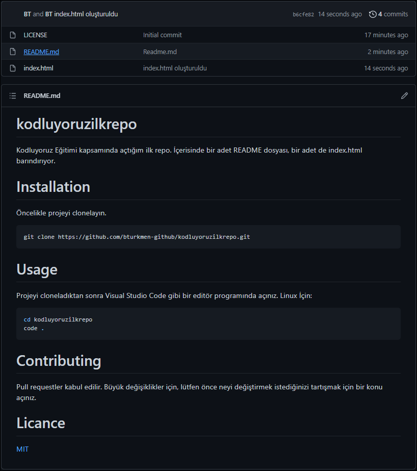

# kodluyoruzilkrepo
Kodluyoruz Eğitimi kapsamında açtığım ilk repo.  İçerisinde bir adet README dosyası, bir adet de index.html barındırıyor.

# Installation
Öncelikle projeyi clonelayın.
```bash 
git clone https://github.com/bturkmen-github/kodluyoruzilkrepo.git 
```

# Usage
Projeyi cloneladıktan sonra Visual Studio Code gibi bir editör programında açınız.
Linux İçin:
```bash
cd kodluyoruzilkrepo
code .
```
# Contributing
Pull requestler kabul edilir. Büyük değişiklikler için, lütfen önce neyi değiştirmek istediğinizi tartışmak için bir konu açınız.

# Licance
[MIT](https://choosealicense.com/licenses/mit/)
